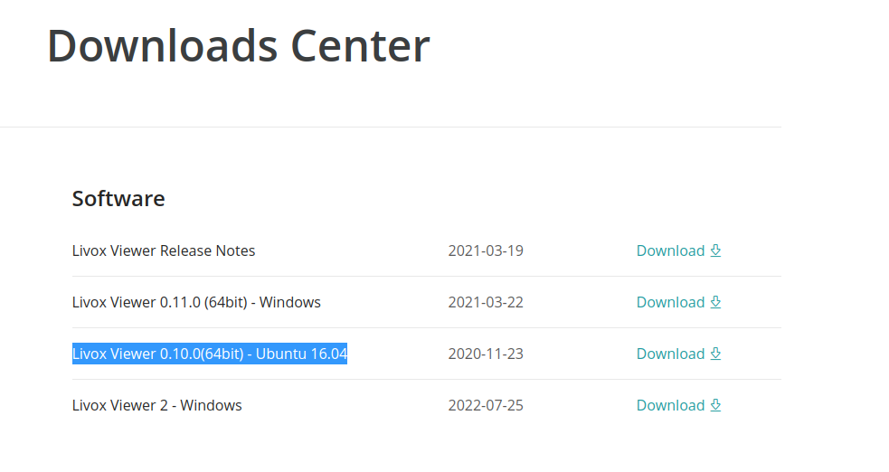
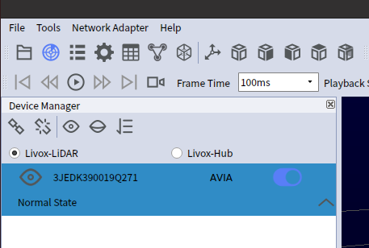
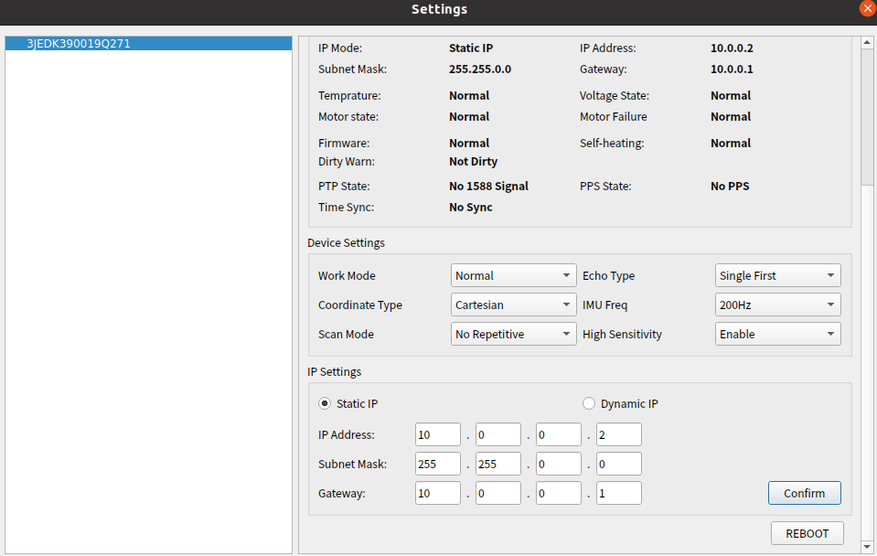
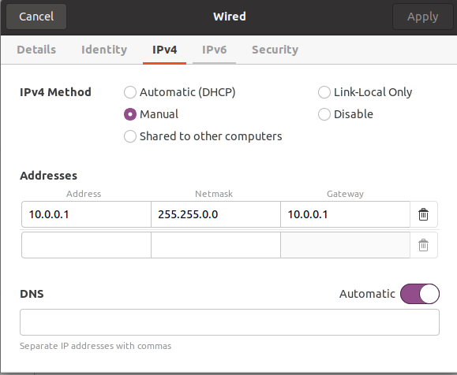

# How to setup Livox Lidar

This documentation provides a short description of how to setup Livox Lidar and ROS2 drivers

## Install Livox SDK
1. `git clone https://github.com/wuxiaohua1011/Livox-SDK`
2. Follow instruction in the readme

## Install Livox Viewer
1. Go to https://www.livoxtech.com/downloads
2. Download `Livox Viewer 0.10.0(64bit) - Ubuntu 16.04`
    - It's okay if your ubuntu version don't match the title

3. unpack and execute `./livox_viewer.sh`

## Configure Livox Lidar IP Address (Only do it on setup!)
0. Connect your LiDAR to both external power source AND ethernet cable. The Ethernet cable does NOT provide power! You should be hearing visible mumble sound to make sure that the lidar is running
1. In livox viewer, enable the device you'd like to change IP Address of

2. Go to Tools -> Device Settings, change the ip address accordingly. 

Note that it is recommended to seperate your LAN ip address from your WiFi ip address. For example, if your Wifi has IP address of 192.168.x.x, you probably want your LAN ip address to be something like 10.0.x.x. 

For Berkeley ROAR go-kart project, we will set all our sensors in the range of 10.0.0.x, and set the subnet mask to 255.255.0.0.

3. Click Confirm and Reboot the LiDAR
4. Change your computer IP Address if needed. Use IPV4 Manual instead of DHCP. 
 
5. Open the Livox Viewer again to ensure that the livox IP address change is successful. 

## Install ROS2 Driver. 
1. clone down the [livox_ros2_driver](https://github.com/wuxiaohua1011/livox_ros2_driver)
2. follow the instruction in the readme
3. when you do colcon build, you might encounter lots of package not found, simply google it and pip install them. 
    - NOTE: if you are missing package `em`, execute `pip install empy`
4. change the `broadcast_code` to the one that shows on your livox 
    - note: you can use the one printed on the device, or it will also show on livox viewer. 
5. after sourcing, run `ros2 launch livox_ros2_driver roar_gokart_avia_lidar.launch.py`
    - in a seperate terminal, run `ros2 rviz2 rviz2` to open rviz window. 
        - You might need to change the map frame to `lidar` and add a lidar topic to view. 

